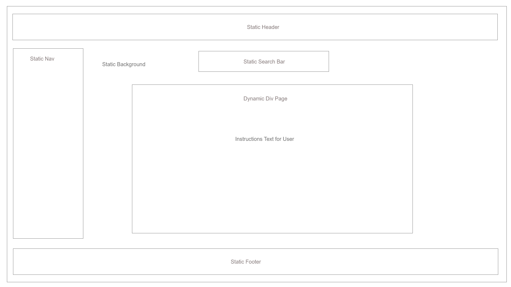

# Band Aid Music App

## About Band Aid
### Concept
A research tool for music junkies needing a quick, on-the-go method of finding new music and tracking what they like in a simple and uninterrupted manner.

### Audience
1. Adults 50 and over wanting to find new artists.
2. Millennials listening to music at work who want to stay on top of music trends.
3. Those looking to learn more about a genre or subgenre.

## Why create this app?
#### Music is a universal connector both on and offline. 
A classmate called me out on my Trampled by Turtles hat and was overcome with joy to find a fellow fan. I swiftly let him down via my lack of folk music knowledge because I lack time to research on my own time and there was no way I was remembering all the artists he was rambling off. Despite letting him down, this was the first interaction I had with a classmate outside of the classroom.

#### Music is important to us because its something that becomes a part of a person.
"Which genre of music is best and why" is a surprisingly dicey issue that seems to always escalate quickly. Why? Everyone has an opinion on music because you can't avoid it. It starts to become a part of your identity.

#### Finding new music is time consuming and we’re busy.
Spotify creates a weekly playlist based on what you like. Problem? Not always spot on and can tell if like a song or not within 30 sec. I can add to my liked artist if I like it and want to look into it later, but then that affects how Spotify generates suggestions. 

If only I could make a list of artists to investigate when I do have the time to delve in deeper?...

## Design Process
### Initial Wireframes
#### Home

#### On Search

### Logo, App Name, Colors, etc.
Aid is a helper and we help find bands. Boom.
Incorporated the band-aid image in a sleek and modern way that wouldn't be mistaken for a medical product.
Colors chosen to make it pop without being overwhelming to the user. 

## Technologies Used
### Front End 
1. HTML/CSS
2. Materialize
3. Javascript
4. JQuery

### Back End
1. APIs - iTunes, MusixMatch (for lyrics)
2. Firebase
3. JQuery
4. Javascript

## My role in app development
I was responsible for the entire front-end design and function.

## Future Development
1. Functionality for the suggested artist: on click, populates main artist area and replaced in carousel by another similar artist.
2. Incorporate YouTube API for music video access.
3. Incorporate Bands in Town or a type of music festival API to suggest similar artists playing at the same festival.

